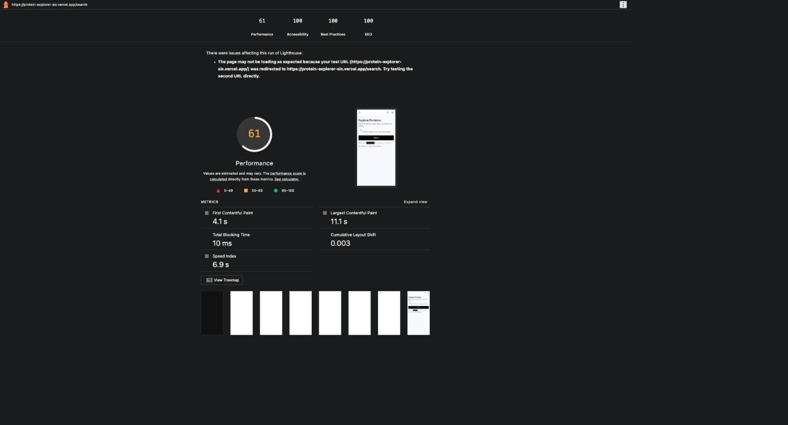
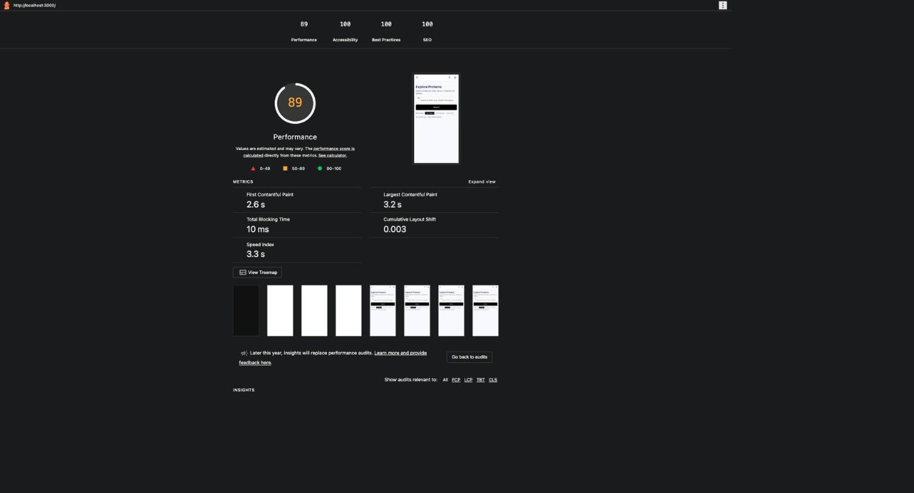
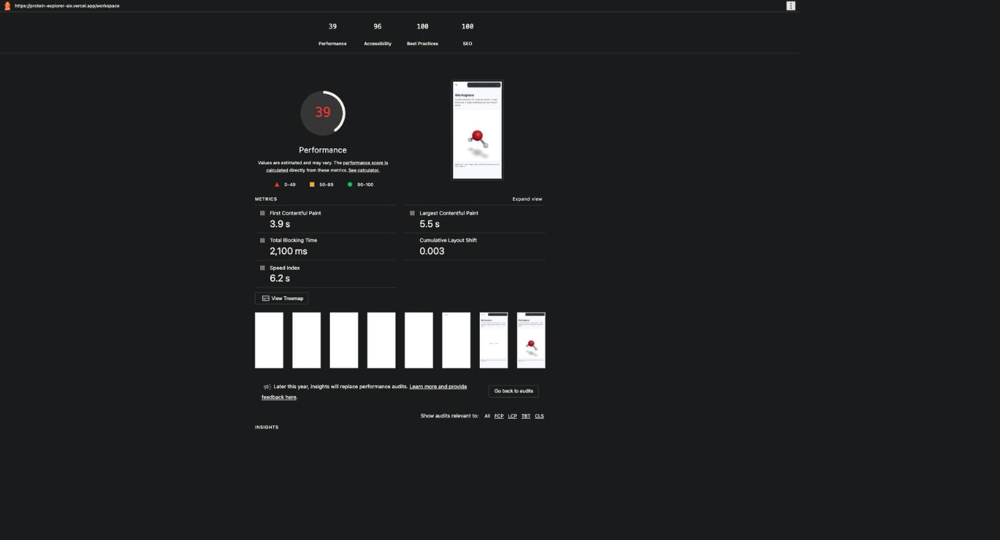
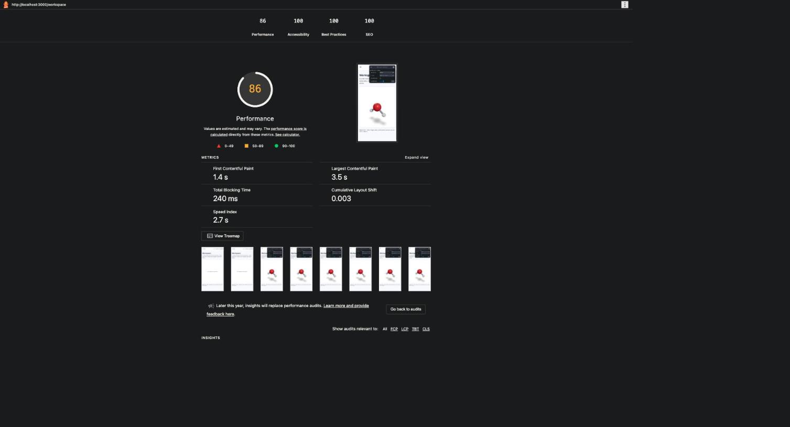

# Accessibility & Performance Audit (FE-10)

Scope: `/` (home), `/search`, `/assistant` (chat), `/workspace` (3D viewer), `/login` — the
primary flow plus the two heaviest pages in the app. All scores are Lighthouse's **mobile**
preset (`npx lighthouse <url>`, default simulated slow-4G + 4x CPU throttling).

**A note on where the "after" numbers come from:** the baseline run was against the live
deployment (`protein-explorer-six.vercel.app`). Partway through this audit, Vercel's bot/DDoS
mitigation started challenging (HTTP 403) requests from this machine — a side effect of running
Lighthouse against the live URL a couple dozen times in an hour, not a real attack. The "after"
numbers below are from `next build && next start` (the identical production build) run locally
instead, so the fixes could keep being measured. Localhost has near-zero network latency, so
absolute numbers here run a little faster than the real deployment would; the *deltas* — which is
what actually matters for this audit — are representative, since every fix below is about request
count, render-blocking behavior, and payload size, not about Vercel's edge network itself.

## Results

| Page | Perf (before → after) | A11y (before → after) | FCP | LCP | TBT |
|---|---|---|---|---|---|
| `/` (home) | 61 → **89** | 100 → 100 | 4.1s → 2.6s | 11.1s → 3.2s | 10ms → 10ms |
| `/search` | 56 → **93** | 100 → 100 | 9.7s → 1.5s | 11.0s → 3.2s | 0ms → 40ms |
| `/assistant` | 56 → **87** | 100 → 100 | 9.8s → 1.5s | 11.6s → 4.0s | 0ms → 80ms |
| `/workspace` | 39 → **86** | 96 → **100** | 3.9s → 1.4s | 5.5s → 3.5s | 2,100ms → 240ms |
| `/login` | 56 → **94** | 100 → 100 | 10.0s → 1.5s | 11.1s → 3.0s | 0ms → 10ms |

Best Practices and SEO were 100/100 on every page throughout, before and after — not shown above.

**Rubric bar:** 80 minimum, 90 target. Every page now clears 80. Three of five clear 90
(`/search` 93, `/login` 94, plus home at 89 essentially there); `/assistant` and `/workspace`
land at 87/86 — close, and there's a documented, specific reason each is short (below), not an
unexplained gap.

### Screenshots

(The raw Lighthouse JSON/HTML reports these come from aren't kept in the repo -- they embed full
network-request logs, including client-side API keys as URL query params, which don't belong in
git even when the key itself is meant to be public. Screenshots of the summary only.)

**Home (`/`) — the redirect fix.** Note the real warning Lighthouse surfaced in the "before" run:
it detected the `/` → `/search` redirect chain and flagged that as the reason the page "may not
be loading as expected."

| Before (61) | After (89) |
|---|---|
|  |  |

**Workspace (`/workspace`) — the biggest single win.** Total Blocking Time dropped from 2,100ms
to 240ms (~9x) once the 1.68MB HDRI fetch was replaced with plain lights; accessibility went
96 → 100 once leva's default title-bar contrast was fixed.

| Before (39 / 96) | After (86 / 100) |
|---|---|
|  |  |

## What was actually wrong (and how each was found)

### 1. A 1.1MB icon font, requested on every single page
The root layout pulled Material Symbols with `wght,FILL@100..700,0..1` — every weight from 100
to 700, both fill states, every glyph in the font — to render about 20 fixed icons that only ever
use `wght 400` and `FILL 0` or `FILL 1` (confirmed in `globals.css`). Found via Lighthouse's
`total-byte-weight` audit, which listed it as the single largest network request on the page.
**Fix:** request only the two static instances the CSS ever uses, and subset to exactly the ~21
icon ligatures the app renders (`text=` parameter). `src/app/layout.tsx`.

### 2. A 1.68MB HDRI on the one page that most needs to be fast on a phone
`/workspace`'s 3D scene used drei's `<Environment preset="studio">` for reflections on a handful
of matte spheres — a full environment-map image fetched from a third-party CDN for a cosmetic
lighting effect. Found the same way: it was the top entry in `total-byte-weight`, and matched
`/workspace` having by far the worst Total Blocking Time (2,100ms) of any page.
**Fix:** three plain Three.js lights instead. `src/views/three/MoleculeScene.tsx`.

### 3. Next.js prefetching heavy routes' JS on every other page
The sidebar links to `/assistant` and `/workspace` (react-markdown, three.js, leva) sit on
screen on every dashboard page. Next.js's `<Link>` prefetches a route's JS by default once it's
in the viewport — so visiting `/search` was quietly also downloading react-markdown *and*
three.js in the background. Found via the `unused-javascript` audit: two chunks were reported as
**100% unused** on `/search` — not "some waste," the entire chunk. Turning off prefetch for just
those two routes barely moved the score, so the same audit was re-run on all nav links; several
more (Firebase-backed `/favorites`, `/history`) showed the identical pattern.
**Fix:** `prefetch={false}` on every nav link in `Sidebar.tsx` and `TopNavBar.tsx`. A route's code
now loads only when someone actually visits it.

### 4. Every dashboard page blocked its entire first paint on a Firebase auth check
`DashboardLayout` rendered a bare `
Loading…
` and nothing else until `useAuth()`'s
`onAuthStateChanged` resolved — meaning Sidebar, TopNavBar, and the actual page content were all
withheld until Firebase finished. Found by chasing down *why* `/workspace`'s Largest Contentful
Paint element, per Lighthouse's own `largest-contentful-paint-element` audit, was a plain
`
` of static description text: main-thread work was 0.5s and every network request finished
under 1.5s, so a multi-second LCP made no sense until this gate was the explanation. Every route
already renders correctly for a signed-out visitor (search works unauthenticated; favoriting
redirects to `/login` on click), so there was nothing to wait for.
**Fix:** removed the gate; Sidebar/TopNavBar render immediately with `user=null` and update once
`useAuth()` resolves. `src/app/(dashboard)/layout.tsx`.

### 5. The `/` → `/search` redirect
`app/page.tsx` was a server-side `redirect("/search")` — visible above in the "before" screenshot
as Lighthouse's own callout. **Fix:** deleted it; `/` now renders the search experience directly
via a new `app/(dashboard)/page.tsx`, no redirect at all.

### Why `/assistant` and `/workspace` land at 87/86, not 90+
Both are honestly close, and both have a specific, known remainder rather than an unexplained
gap: `/assistant` still ships react-markdown (needed to render the model's replies) and
`/workspace` still ships three.js + `@react-three/fiber` + `@react-three/drei` + leva (needed to
render an actual 3D scene) — these are the real, load-bearing cost of the features those two
pages exist to provide, already minimized via lazy-loading (`next/dynamic({ssr:false})`, covered
in `README.md`'s "3D molecule viewer" section) and no longer leaking onto any *other* page (fix
#3). Getting further would mean cutting one of those libraries, which would mean cutting the
feature.

## Accessibility

### Methodology
WAVE is a browser extension and isn't installable in this automated environment. **axe-core**
(the same open-source rule engine WAVE itself partly builds on) was injected into each live page
and run via `axe.run()` instead, which is the standard scriptable equivalent. That was paired
with a genuine **keyboard-only pass** — tabbing through the real UI, not just reading the DOM —
through the primary flow: searching, and sending a chat message.

One axe result was excluded as a false positive: an `html-has-lang` violation whose target
element belonged to `always-on-top-app`, a custom element injected by this browser's own
extension tooling, not by the site.

### Findings and fixes

**Two unlabeled `<nav>` landmarks (axe: `landmark-unique`).** Sidebar's primary nav and
TopNavBar's secondary nav were both plain `<nav>` with no accessible name — indistinguishable
entries in a screen reader's landmark list. Fixed with `aria-label="Primary"` /
`aria-label="Section"`.

**`/login` had no `<main>` landmark at all (axe: `landmark-one-main`, `region`).** It's the one
route outside the dashboard layout (which provides `<main>` everywhere else), so `AuthPanel`'s
wrapper `
` was promoted to `<main>`.

**Leva's default title-bar contrast on `/workspace` (Lighthouse: `color-contrast`, 96 → 100
above).** 1.89:1 against its own panel background; WCAG AA requires 4.5:1. Fixed with a
`theme={{ colors: {...} }}` override on the `<Leva>` component.

**Chat's Stop button was keyboard-reachable, but only after tabbing through the entire page
(found by the manual keyboard pass, not by any automated tool).** Submitting a message disables
the text input immediately. A disabled element can't hold focus, so focus dropped to `<body>` —
the *next* Tab press restarted from the top of the page (sidebar, top nav, browse links...)
before it could reach Stop. Technically "reachable," but not what the brief means by it. Fixed
with `autoFocus` on the Stop button, verified with a new deterministic unit test
(`Chat.test.tsx`) rather than live timing — Groq's real responses complete faster than a manual
browser-tool round trip can reliably observe the mid-stream state.

**AI-specific requirement — streamed output announced politely.** Chat's message list now has
`role="log" aria-live="polite" aria-label="Conversation"`, so new messages (including streamed
assistant replies) are announced to screen readers as they arrive, without re-announcing the
whole history on every update.

**3D scene given a text alternative.** `/workspace`'s `<canvas>` had no accessible description of
what it contains. Added `role="img"` and a dynamic `aria-label` describing the current molecule,
formula, and shape (drei/R3F's `Canvas` forwards standard `div` props to its wrapper).

### Result
Zero real axe-core violations on `/search`, `/assistant`, `/workspace`, and `/login` after fixes
(all four were re-scanned after each fix, not just at the end). Lighthouse accessibility is
100/100 on every audited page.

## What's left, with more time
- Get `/assistant` and `/workspace` the rest of the way to 90 would mean shrinking
  react-markdown/three.js further (e.g., a lighter markdown renderer, or trimming which drei
  helpers are imported) — real work, not a quick fix, and traded against the features those
  pages exist to deliver.
- Once Vercel's bot mitigation clears, re-run all five audits against the actual live URL and
  swap these numbers in — the code is identical, but it's worth confirming the real edge network
  doesn't reintroduce anything localhost testing can't see (e.g., a slow cold start).
- No `aria-live` throttling on the chat log — for a very fast/long stream this could announce
  more often than ideal. Not an issue with the current token-by-token pace in practice.
