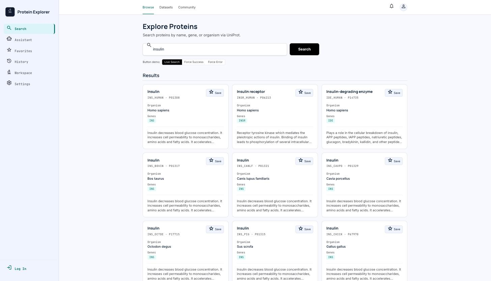
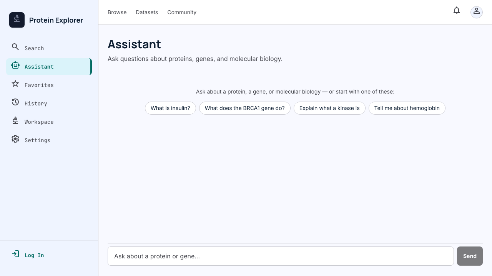
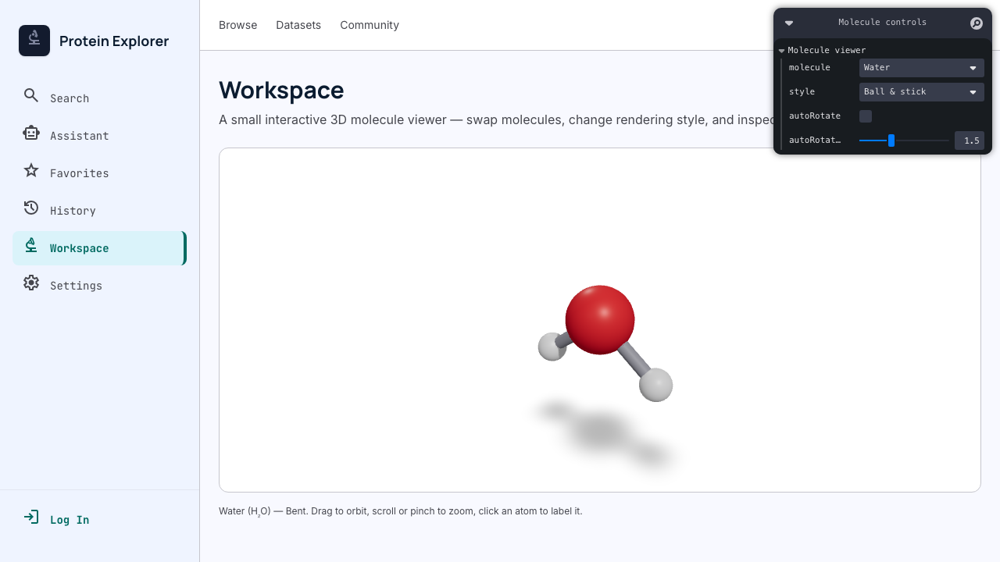
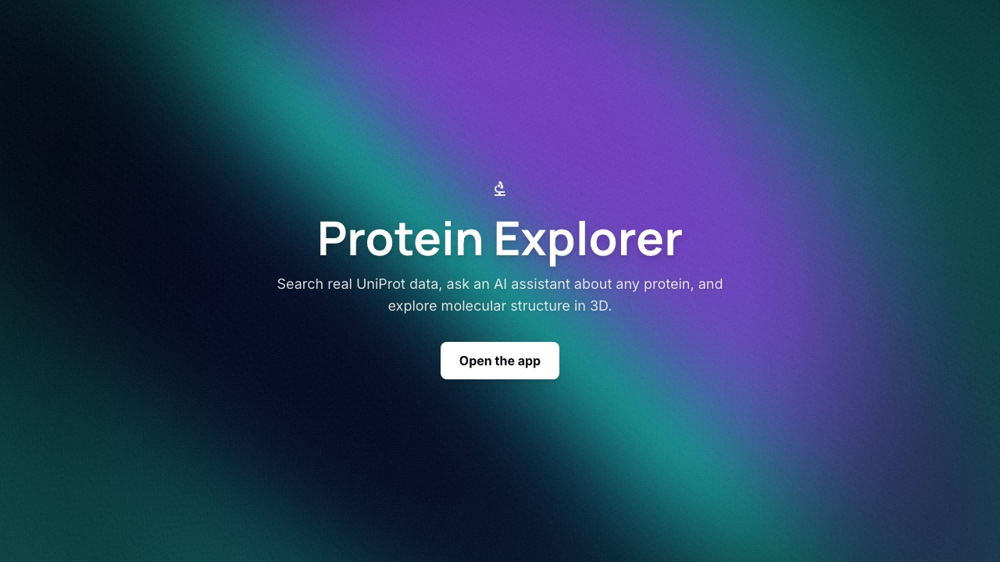

# Protein Explorer

Search real protein data via [UniProt](https://www.uniprot.org/), ask an AI assistant about any
protein, explore molecular structure in 3D, and save favorites to an account.

**Live:** https://protein-explorer-six.vercel.app
**Health check:** https://protein-explorer-six.vercel.app/health

## What it does

- **Search** — real UniProt data by protein name, gene symbol, or organism, with a save-to-favorites flow.
- **AI assistant** (`/assistant`) — ask about a protein or general molecular biology; the model calls a
  server-side tool to fetch real UniProt data instead of making it up, and renders the result as a
  real component.
- **3D workspace** (`/workspace`) — an interactive molecule viewer (water, ammonia, methane, CO₂),
  built from real bond geometry, not a loaded 3D model.
- **Accounts** (Firebase) — sign in to save favorites and see search history; everything else works
  fully signed-out.

## Screenshots

| Search | AI Assistant |
|---|---|
|  |  |

| 3D Workspace | Shader hero (`/about`) |
|---|---|
|  |  |

## Architecture overview

Four folders under `src/`, and data only ever flows in one direction through them:

```
models/       Shared types ("what is a Protein?") -- no logic.
services/     How to fetch one ("UniProt client", "Firebase init", "AI tools") -- no React.
viewmodels/   React hooks that hold screen state and call services (useProteinSearch, useAuth, ...).
views/        Presentational components. No fetching, no business logic.
app/          Next.js App Router routes/layouts on top of all of the above.
```

A `view` never calls `fetch` directly — it calls a `viewmodel`, which calls a `service`, which
returns a `model`. The AI assistant is the same shape with one extra hop: the model can't touch
data directly, it can only request a **tool call** (`lookupProtein`), which the server actually
runs — the exact same `searchProteins()` service function `/search` uses. See
[`HOW_IT_WORKS.md`](HOW_IT_WORKS.md) for the fuller, more narrative version of this (a full
request trace from click to render, and why auth doesn't block anything).

## Stack

- Next.js 16 (App Router) + TypeScript, deployed on Vercel
- Tailwind CSS v4
- Firebase (Auth + Realtime Database) for accounts and favorites
- UniProt REST API for protein search (no key required)
- Groq (Llama 3.3 70B) + Vercel AI SDK for the chat assistant
- React Three Fiber + Three.js for the 3D viewer; plain WebGL (no 3D library) for the shader hero
- Vitest + React Testing Library (unit/component) and Playwright (e2e)

## Structure

```
src/
  models/       # Shared types
  services/     # UniProt client, Firebase init, AI chat tools + rate limiting
  viewmodels/   # Client-side hooks (auth, search, favorites, history)
  views/        # Presentational components
  app/
    (dashboard)/  # Authenticated-optional screens: search (also /), favorites, history,
                  # settings, workspace, datasets, community
    about/        # Public shader-hero landing page
    login/        # Public auth screen
    health/       # Public, unauthenticated health-check page
    api/chat/     # AI assistant route handler
```

## Environment variables

Copy `.env.example` to `.env` and fill these in. All `NEXT_PUBLIC_*` values are safe to expose to
the browser by design (they're Firebase's own client config, not secrets — see
[Firebase's docs](https://firebase.google.com/docs/projects/api-keys)); real access control is
Firebase Security Rules, not hiding these values. `GROQ_API_KEY` is the one that must stay
server-side.

| Variable | Required | Where to get it |
|---|---|---|
| `NEXT_PUBLIC_FIREBASE_API_KEY` | Yes | Firebase Console → Project settings → General → Your apps |
| `NEXT_PUBLIC_FIREBASE_AUTH_DOMAIN` | Yes | Same screen |
| `NEXT_PUBLIC_FIREBASE_DATABASE_URL` | Yes | Firebase Console → Realtime Database |
| `NEXT_PUBLIC_FIREBASE_PROJECT_ID` | Yes | Firebase Console → Project settings |
| `NEXT_PUBLIC_FIREBASE_STORAGE_BUCKET` | Yes | Same screen |
| `NEXT_PUBLIC_FIREBASE_MESSAGING_SENDER_ID` | Yes | Same screen |
| `NEXT_PUBLIC_FIREBASE_APP_ID` | Yes | Same screen |
| `GROQ_API_KEY` | Yes, for `/assistant` | [console.groq.com](https://console.groq.com/keys) — free tier available |

Without `GROQ_API_KEY` every other page works normally; only `/assistant` breaks. Without the
Firebase vars, the app fails to initialize (auth/favorites/history are load-bearing everywhere).

## Run it locally

```bash
npm install
cp .env.example .env      # fill in your own Firebase project + Groq key
npm run dev                # http://localhost:3000
```

Other commands a reviewer will want:

```bash
npm run build && npm start # production build + serve (catches issues npm run dev doesn't)
npm run test                # Vitest unit/component suite
npm run test:e2e            # Playwright end-to-end (starts its own dev server)
npm run lint
```

CI (`.github/workflows/test.yml`) runs the unit and e2e suites on every push to `master`.

## Production hygiene

The AI route (`src/app/api/chat/route.ts`) is the one endpoint that costs real money per request
(Groq API usage), so it's the one endpoint with abuse protection:

- **Input caps** — a request is rejected (`400`) if the conversation has more than 40 messages, or
  if any single message exceeds 2000 characters. Stops someone burning the token budget with one
  giant paste or an artificially long conversation.
- **Rate limiting** — 20 requests per 60 seconds per IP (`429` + `Retry-After` header beyond that),
  implemented in [`src/services/rate-limit.ts`](src/services/rate-limit.ts) as an in-memory sliding
  window. **Documented limitation, stated plainly:** this state lives in one serverless function's
  memory, so it doesn't survive a cold start and isn't shared across concurrent instances under
  real traffic — it stops the trivial case (a script hammering the endpoint in a tight loop, which
  mostly lands on the same warm instance), not a distributed attack. The real fix at scale is a
  shared store (Upstash Redis / Vercel KV); not added here because this app doesn't have the
  traffic to need it yet, and adding infrastructure for a threat model that doesn't exist yet is
  the wrong trade.
- **`maxDuration = 30`** on the route — long enough for a tool call (UniProt lookup) plus a full
  streamed answer, short enough that an abandoned or hung connection can't tie up serverless
  compute indefinitely.

All three verified with real requests (not just read from the code) — see the commit that added
them for the exact `curl` commands used to trigger each one.

## Cross-browser pass

Automated with Playwright, driving the actual Chromium and Firefox engines (not just
"looks fine in one browser") across all five key routes (`/about`, `/search`, `/assistant`,
`/workspace`, `/login`): **10/10 page loads returned 200 with zero console errors** in both.
Raw output: [`docs/cross-browser-log.txt`](docs/cross-browser-log.txt).

**Safari:** Playwright's local WebKit engine build is explicitly "frozen" (no longer updated,
confirmed by its own install-time warning) and hung indefinitely on every page load in this
environment — a tooling problem, not something the app is doing wrong. In its place: an audit of
the actual compiled CSS output, which uses `color-mix()` and `@property` (Tailwind v4's own
minimum browser baseline: **Safari 16.4+**, released March 2023 — a completely standard floor for
a 2026 app, not a real compatibility risk) and a source-level scan confirming no Safari-only-broken
APIs are used anywhere (`requestIdleCallback`, `:has()`, `backdrop-filter`, etc. — none present).
The WebGL work (`/workspace`, `/about`) deliberately targets WebGL1 (`gl.getContext("webgl")`,
never `webgl2`-only features), which Safari has supported since version 8. A real Safari/mobile
Safari spot-check is still worth doing by hand before treating this as fully proven — the audit
above is strong evidence, not a substitute for actually looking at it.

## Key decisions

- **Next.js App Router over the original Vite SPA** — migrated mid-project once a real routing/
  deployment/health-check requirement surfaced the original scaffold's gaps, rather than bolting
  those on top of a SPA router.
- **Per-feature auth, not an app-wide gate** — Search, the assistant, and the 3D viewer all work
  fully signed-out; only saving a favorite or viewing history/settings prompts login. A reviewer
  (or a real first-time visitor) should never hit a login wall before seeing the product.
- **Server-side AI tool calls, not client-side data fetching from the chat** — the model can only
  *request* `lookupProtein`; the server decides whether to run it and what comes back. The result
  renders as a real `ProteinResultCard`, not text the model composed — same data path as `/search`.
- **Procedural 3D molecules over loaded GLB models** — water/ammonia/methane/CO₂ are computed from
  real bond lengths/angles in code (a few dozen floats), so there's no 3D asset to load, compress,
  or version at all for this scope.
- **Plain WebGL for the shader hero, not react-three-fiber** — a flat 2D shader effect has no scene
  graph; a canvas and two small shaders is the whole implementation, no 3D library needed.
- **In-memory rate limiting over a hosted store, for now** — a real, stated trade-off (see
  "Production hygiene" above), not an oversight.
- **`/` renders the search screen directly, no redirect** — was previously `redirect("/search")`;
  removed after a Lighthouse audit measured the real cost of that extra round trip (see `AUDIT.md`).

## Chat tool contract (FE-07)

The chat assistant (`/assistant`) can call a server-side tool to fetch real UniProt data and
render it as a component instead of prose.

- **name:** `lookupProtein`
- **input schema (Zod):** `{ query: string }` — a protein name, gene symbol, or keyword
- **return shape:** `Protein { accession, id, name, organism, genes: string[], function: string | null }`
- **states rendered distinctly** (`src/views/ProteinToolParts.tsx`):
  - `input-streaming` → pending row ("Preparing protein lookup…")
  - `input-available` → running row ("Looking up **{query}**…")
  - `output-available` → `ProteinResultCard` component
  - `output-error` → designed error card (thrown by `execute` when no entry is found)

Tool definition: [`src/services/chat-tools.ts`](src/services/chat-tools.ts). Registered in the AI
route (`src/app/api/chat/route.ts`) with `stopWhen: stepCountIs(5)` so the model calls the tool
and then writes a follow-up sentence. Streamed replies are announced to screen readers via
`role="log" aria-live="polite"` on the message list, and the Stop button `autoFocus`es the instant
it appears so a keyboard user's focus doesn't fall off the page mid-stream (see `AUDIT.md`'s
accessibility section for how that bug was actually found).

## Stateful Search button — motion notes (FE-AA1)

The Search button (`src/views/StatefulButton.tsx`, live on `/search`) choreographs its full
lifecycle: **idle → hover/focus → loading → success/error → idle**, wired to the real UniProt
search. A demo toggle on `/search` forces the success and error states on demand.

Duration / easing choices:

- **200ms, `ease-out`** for color and label swaps — fast enough to feel instant, long enough to
  read as a transition rather than a snap.
- **240ms, `cubic-bezier(0.22, 1, 0.36, 1)`** for the label ↔ spinner ↔ check slide, so each layer
  *decelerates* into place instead of moving linearly.
- **400ms, `ease-in-out`** for the error shake — one quick, assertive wobble, then done.
- **700ms, linear** for the spinner loop — steady, so it reads as "working," not stuttering.

Only `transform` and `opacity` animate, and the button has a fixed `min-width`, so nothing
reflows (no layout thrash). It's interruptible (clicks are ignored mid-flight), keyboard
accessible with a visible focus ring, and honors `prefers-reduced-motion` — the slide and shake
are dropped, but color and fade feedback remain.

## 3D molecule viewer (Workspace)

`/workspace` is a small interactive 3D experience: a ball-and-stick / space-filling molecule
viewer built with **React Three Fiber**. Water, ammonia, methane, and carbon dioxide are rendered
from real bond lengths and bond angles computed in code (`src/services/molecules.ts`), not from a
loaded model file — there's no GLB/GLTF asset at all, so there's nothing to compress or optimize
on that front; the entire "model" is a few dozen floats.

- **Interactions beyond orbiting:** a [leva](https://github.com/pmndrs/leva) panel swaps the
  molecule, toggles ball-and-stick vs. space-filling rendering, and drives an auto-rotate
  animation; clicking an atom highlights it and labels it (element + index) via `<Html>`.
- **Loads responsibly:** `src/views/three/MoleculeScene.tsx` (three.js + `@react-three/fiber` +
  `@react-three/drei`) is loaded with `next/dynamic({ ssr: false })` from
  `src/views/MoleculeViewerPanel.tsx`, so it's fetched only when a visitor actually opens
  `/workspace` — every other route (`/search`, `/assistant`, etc.) never downloads it.
- **Fallbacks:** if `getContext("webgl")` fails, or if `prefers-reduced-motion` is set, the canvas
  is replaced by `src/views/three/WebGLFallback.tsx`, a static flat projection of the same atom
  coordinates (reduced-motion users get a "show it anyway" button, since that's a request they can
  make, not a capability they lack).
- **Frame budget:** the scene only re-renders continuously (`frameloop="always"`) while
  auto-rotate is on; otherwise it's `frameloop="demand"` — 0 extra frames/sec at idle, and drag
  input still invalidates and renders normally under "demand" (this is a documented drei
  `OrbitControls` behavior, not something bolted on). Geometry is a few dozen spheres/cylinders
  with no textures, so frame rate isn't a real constraint on any device this runs on.
- **Mobile:** `OrbitControls`' default touch mapping (one-finger rotate, two-finger pinch/pan)
  works out of the box. The leva panel is fixed-position and doesn't reflow on its own, so it
  starts **collapsed** below the `md` breakpoint (768px) instead of covering the canvas.

**Perf note (production build):** the three.js + `@react-three/fiber` + `@react-three/drei` chunk
is 964KB raw / 260KB gzipped; leva adds roughly another 150KB gzipped. That's a real cost — but
it's paid exactly once, exactly by visitors who open `/workspace`, entirely separate from the main
app bundle every other page ships. The lazy `next/dynamic` boundary is what makes that trade-off
acceptable; without it, every route in the app would carry three.js's weight.

**With more time:** DRACO-compressed real PDB structures (via three.js's `PDBLoader`) for actual
proteins instead of small illustrative molecules — the reason this stayed procedural is that
cartoon/ribbon secondary-structure rendering is its own significant project, not something to
bolt on inside a 5-hour assignment.

## Shader hero (`/about`, FE-AA3)

A fullscreen WebGL fragment shader — deep indigo → teal → violet flow ribbons (three summed sine
waves, not a noise texture), warped gently toward the cursor, with a vignette that keeps the
headline readable and a subtle grain pass to stop the gradient from banding. Plain WebGL rather
than react-three-fiber: it's a 2D effect with no scene graph, so a canvas and two small shaders is
the whole implementation (`src/views/ShaderHero.tsx`), no 3D library needed. Uses all three core
uniforms (`u_time`, `u_resolution`, `u_mouse`). GLSL source is commented section-by-section in the
same file.

**Perf/reduced-motion fallback in one line:** `prefers-reduced-motion` renders one static shader
frame instead of starting the animation loop, the tab-hidden case pauses/resumes the same loop via
the Page Visibility API, devicePixelRatio is capped at 2x for the canvas's backing store, and the
canvas has a static CSS gradient in the same palette as its own background — so a browser with no
WebGL support (or a failed context) shows that gradient and nothing ever throws.

## Testing (FE-09)

42 Vitest/React Testing Library tests across 9 of 17 view components (chat rendering across
pending/streaming/error states and all four tool-lifecycle states, form validation, tool-result
cards, nav active-state and auth-conditional rendering, the search button's state machine), all
querying by role/label rather than test IDs, plus one Playwright end-to-end test covering the
primary search flow with the UniProt API mocked at the network boundary. The AI route is never
called for real in tests — `useChat` is mocked so component tests assert on rendered state, not on
Groq being up. Full CI wiring in `.github/workflows/test.yml`.

## Accessibility & performance (FE-10)

A full Lighthouse mobile + accessibility audit — baseline scores, five root causes traced and
fixed (an oversized icon font, an unnecessary 1.68MB 3D lighting image, Next.js prefetching heavy
routes' JS onto every page, an auth check blocking every page's first paint, a redirect chain),
real accessibility findings from an axe-core scan plus a manual keyboard-only pass (including a
genuine keyboard-focus bug an automated tool didn't catch), and after scores confirming each fix —
lives in [`AUDIT.md`](AUDIT.md) with before/after screenshots.

## How AI tools built this

Built with Claude Code as the primary development assistant, start to finish — every feature above,
the tests, the audit, this README. The detailed, prompt-by-prompt log for the earliest phase
(concept → Firebase setup → the Vite→Next.js migration → the auth rework) is in
[`AI_DEVELOPMENT.md`](AI_DEVELOPMENT.md); what follows is specific, verifiable examples from later
phases, not a general "AI helped a lot."

**Real bugs AI assistance found, not just wrote code around:**

- **Two testing-infrastructure bugs, found by actually running the suite, not by inspection**:
  jsdom has no `scrollTo` (Chat.tsx's auto-scroll effect threw on every test render until stubbed
  in the test setup file), and React Testing Library doesn't auto-cleanup between tests under
  Vitest by default — the second one produced a false-positive test *pass* (a leftover DOM node
  from a prior test satisfied an assertion the current test should have failed) until
  `afterEach(cleanup)` was added.
- **A Lighthouse metric that didn't add up, traced to its actual cause instead of accepted at face
  value**: `/workspace` reported a 5.5s Largest Contentful Paint — on a plain `<p>` of static
  description text. Network requests all finished under 1.5s and main-thread work was 0.5s, so a
  multi-second LCP on *text* made no sense. The actual cause: `DashboardLayout` rendered a bare
  "Loading…" and nothing else until a Firebase auth check resolved, on *every* page — removing that
  gate (every route already works signed-out) fixed it.
- **The same audit's `unused-javascript` finding**: two JS chunks reported as **100% unused** on
  `/search` — not "some waste," the entire chunk. Root cause: the sidebar links to `/assistant` and
  `/workspace`, and Next.js prefetches a visible `<Link>`'s route JS by default, so every dashboard
  page was quietly downloading react-markdown *and* three.js in the background regardless of which
  page a visitor actually opened.
- **A keyboard bug no automated tool flagged**: axe-core and Lighthouse's accessibility audit both
  came back clean on `/assistant`, but a manual keyboard-only pass found that submitting a chat
  message disables the text input immediately — and a disabled element can't hold focus, so focus
  silently dropped to `<body>`. The Stop button was technically still reachable, just only after
  tabbing through the entire page from the top. This is the kind of bug that specifically requires
  *using* the keyboard, not reading the DOM.
- **A GitHub secret-scanning alert, correctly contextualized rather than either ignored or
  panic-fixed**: committed Lighthouse reports embedded a Firebase API key as a URL query param.
  Rather than treating it as a leaked secret, the actual nature of the key was checked first — it's
  `NEXT_PUBLIC_FIREBASE_API_KEY`, which Firebase's own docs say is safe to expose (it's already
  visible in the deployed site's JS bundle to anyone; real access control is Security Rules, not
  key secrecy) — then still removed the raw reports from the repo (they didn't belong there
  regardless) and rotated the key anyway, at the user's explicit choice, as defense-in-depth rather
  than a required fix.
- **This same submission**: the cross-browser pass above used Playwright's real Firefox and
  WebKit engines, not just Chrome. When WebKit hung indefinitely (a known-frozen local build,
  confirmed by Playwright's own warning, not an app bug), the honest move was to say so plainly and
  substitute a real compiled-CSS compatibility audit — not to quietly drop the Safari check or
  fabricate a result.

**Manual corrections after reviewing AI-generated code** (condensed from `AI_DEVELOPMENT.md`; see
that file for the full list from the project's earliest phase):

- A CSS cascade bug where the icon font's hardcoded size silently beat a Tailwind utility class —
  fixed by wrapping the icon CSS in `@layer base`.
- Firebase's Realtime Database was left in test mode (the default for a new project) — verified
  wide open with a plain unauthenticated `curl`, fixed with rules scoped to the authenticated
  user's own data, then re-verified the same `curl` now gets rejected.
- A design-mockup port that included a stock photo standing in for the logged-in user's avatar and
  a second, non-functional search box — both cut rather than shipped, since a stranger's photo
  posing as "you" is actively misleading, not just unpolished.

## Deployment

Connected to Vercel via GitHub — every push to `master` triggers a new production deployment, and
CI (unit + e2e tests) runs independently on the same push. They don't currently gate each other —
a failing test doesn't block the Vercel deploy — worth tightening if this app needs that guarantee
later.

**Git history:** kept as real, chronological commits with descriptive messages throughout (no
history rewrite was needed for this submission — `git log --oneline` reads as a build log, not a
sequence of "wip"/"fix" noise commits).
